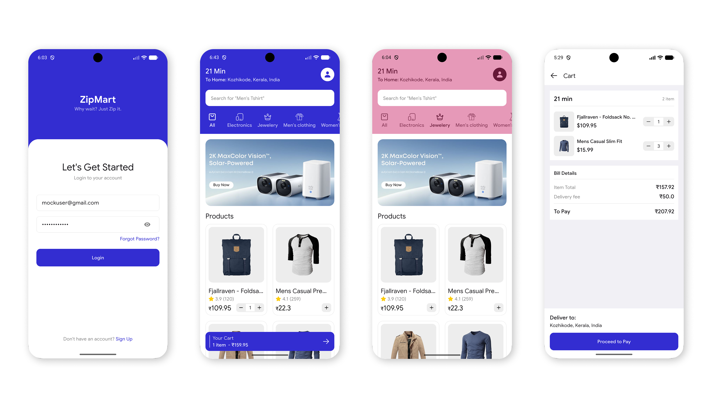

# ZipMart 🛒

> *Why wait? Just Zip it.*

A functional quick-commerce Flutter app inspired by Swiggy Instamart, built as part of a Flutter Engineer Technical Assessment.

---

## 📸 Screenshots



> The header dynamically changes color based on the selected category — blue for "All", pink for "Jewellery", and so on.

---


## 🚀 Getting Started

### Prerequisites

- Flutter SDK: `>=3.41.1`
- Dart SDK: `>=3.11.5`
- Android Studio / VS Code with Flutter plugin
- A connected device or emulator (Android/iOS)

### Installation

```bash
# Clone the repository
git clone https://github.com/faizsr/zipmart
cd zipmart

# Install dependencies
flutter pub get

# Run the app
flutter run
```

> **Note:** The app uses the [FakeStore API](https://fakestoreapi.com/) for product and category data. An active internet connection is required.

---

## 🏗️ Architecture

ZipMart is built using **Feature-First Clean Architecture**, where the codebase is organized by feature rather than by layer. Each feature encapsulates its own `data`, `domain`, and `presentation` layers.

```
lib/
├── src/
│   ├── config/
│   │   ├── di/                   # Dependency injection setup (get_it)
│   │   └── router/               # App routing configuration
│   │
│   ├── core/
│   │   ├── constants/            # App-wide constants (strings, keys, etc.)
│   │   ├── network/              # Dio client, interceptors, error handling
│   │   ├── styles/               # Theme, colors, text styles
│   │   ├── utils/                # Helper functions and extensions
│   │   └── widgets/              # Shared/reusable widgets
│   │
│   └── features/
│       ├── auth/                 # Login screen, AuthBloc, auth repository
│       │   ├── data/
│       │   ├── domain/
│       │   └── presentation/
│       ├── cart/                 # CartBloc, cart screen, floating banner
│       │   ├── data/
│       │   ├── domain/
│       │   └── presentation/
│       ├── dashboard/            # Product grid, categories, banners
│       │   ├── data/
│       │   ├── domain/
│       │   └── presentation/
│       ├── profile/              # User profile screen
│       │   ├── data/
│       │   ├── domain/
│       │   └── presentation/
│       └── splash/               # Splash screen & auth gate
│           ├── data/
│           ├── domain/
│           └── presentation/
│
└── main.dart
```

### Key Architectural Decisions

- **BLoC for state management:** All business logic lives in BLoC classes. UI widgets only dispatch events and react to states — zero business logic in the presentation layer.
- **Repository pattern:** Each feature's `domain` layer defines an abstract repository contract. The `data` layer provides the concrete implementation, keeping the domain completely decoupled from network/storage concerns.
- **Global CartBloc:** The cart state is provided at the app root using `MultiBlocProvider`, ensuring the cart is accessible and reactive across all screens without prop-drilling.
- **Dependency Injection:** Dependencies are wired up in the `core/di` layer using `get_it`, keeping constructors clean and enabling easy swapping of implementations.

---

## ✅ Features Implemented

### Authentication
- Clean login UI with email and password fields.
- Client-side validation: valid email format + password longer than 6 characters.
- On success, a dummy token is persisted via `shared_preferences` and the user is navigated to the Dashboard.
- `AuthBloc` manages authenticated/unauthenticated states.

### Dashboard
- **Animated Header:** Dynamic background color that changes based on the selected category, with a `SliverAppBar` that collapses smoothly on scroll.
- **Promotional Banners:** Horizontally scrollable banner carousel using placeholder network images.
- **Categories:** Fetched from `GET /products/categories` and displayed as horizontally scrollable icon widget.
- **Product Grid:** Fetched from `GET /products` and displayed in a 2-column grid.
- **ADD → Quantity Selector Micro-interaction:** Each product card features an "ADD" button that transitions to a `[-] 1 [+]` inline quantity selector on tap, exactly like Swiggy Instamart.
- **Shimmer loading states** while API data is being fetched.
- **Error state UI** with a "Retry" button if the API call fails.

### Cart
- **Global CartBloc** manages all cart operations — add, increment, decrement, and remove items.
- **Floating Cart Banner:** Appears on the Dashboard whenever the cart is non-empty, showing item count, total price, and a "View Cart" button.
- **Cart Screen:** Lists all added items with quantity controls, displays a dynamically calculated Item Total + Mock Delivery Fee.
- **Error state UI** when cart is empty

---

## 📦 Tech Stack

| Concern | Package |
|---|---|
| State Management | `flutter_bloc` |
| Networking | `dio` |
| Local Storage | `shared_preferences` |
| DI | `get_it` |
